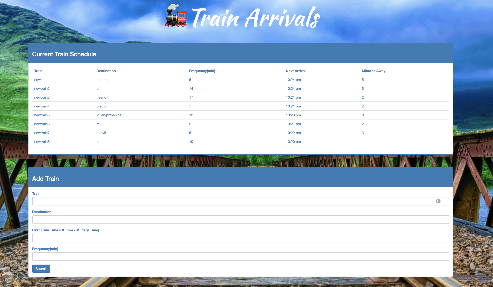

# 🚂 Train Scheduler

## Overview
In this assignment, a train schedule application was created in order to demonstrate understanding of Firebase. The app displays primarily hosts arrival and departure data, which is manipulated using Moment.js,but also displays other information such as the name of the trains, their arrival times, and how many minutes remain until they arrive at the station.

## Use
Please see the image below for a preview of the app:

Follow the link to view the published assignment: https://ahydorn.github.io/train-activity/

## Technologies Used
* HTML
* CSS
* Bootstrap
* Javascript
* jQuery
* Firebase
* Moment.js

Created by Adam Hydorn for UC Berkeley Extension Full Stack Bootcamp, 2019
